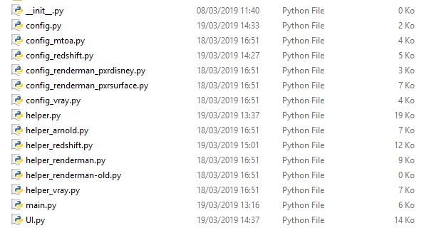
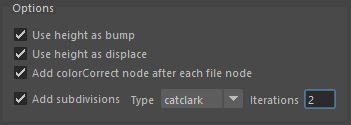

# Substance to Maya
## version 0.1

This tool is used to automatically connect Substance Painter textures to Arnold, VRay and Renderman for Maya.

## Installation
* Put the SubstancePainterToMaya folder in a maya script directory (I.e: C:\Users\user\Documents\maya\scripts on Windows)    
  

* The content of the folder need to be this one  
  
 
* Create a shelf button in Maya with the following Python command  
  

## How to use
1. Open a scene
  
2. Click on the shelf button to launch the tool  
  
3. Define the texture folder
4. Define the Naming Convention ([more...](NamingConvention.md))
5. Choose the renderer
6. Choose a materials option
7. Click on Launch  
  
8. Specify where to plug each found maps
9. Choose some options  
  
10. Click on Proceed  
  
11. Enjoy !  
  

## Features details

* #### Texture folder
Choose the folder that contains your Substance Painter textures  
Click **Get** to open a dialog and the folder  
By default, the tool uses the sourceImages folder of your project

* #### Naming convention
Enter the textureSet name and the map name of one of your textures.  
Be careful with the lowers and the CAPITALS letters  
[More on the naming convention](NamingConvention.md)

* #### Renderer
Choose the renderer you want to use

* #### Materials
**Create new ones if they doesn't exist, instead use existing ones**  
If the tool find shaders named like your textures's textureSet, and if the shaders are the ones used by your renderer, the textures will be plugged in those shaders, instead, the tool will create new shaders with the name and '_shd' as suffix. 
**Create new ones**  
The tool will create new shaders and plug the textures in them and add '_shd' suffix to the found name.  
**Use existing ones**  
If the tool find shaders named like your textures's textureSet, and if the shaders are the ones used by your renderer, the textures will be plugged in those shaders, instead, nothing will append.

* #### Launch and Re-launch
Click this button to search for the textures and create the second part of the UI.  
Click the Re-launch button if you've changed the texture folder, the naming convention, the renderer, or after you've moved new textures in the Texture Folder and want to use that changes.

* #### Found Maps
Based on your Naming Convention, the tool will create lines  
On the left are the found names, and for each name, a dropdown menu is created on it's right to let you specify in which parameter you want to plug that map.   
The script automatically purpose parameters for usual maps  
(I.e: baseColor, BaseColor, albedo... are related to the baseColor/diffuse parameter, but you can choose another one in the dropdown menu)   

* #### Options
**Use height as bump**  
If enabled, the height maps will be used as bump maps (if there's also a normalMap, both will be used)  
**Use height as displace**  
If enabled, the height maps will be used as displacement maps     
**Add colorCorrect node after each file node**  
If enabled, the tool will add a colorCorrect node after each file node  
**Add subdivisions**  
If enabled, you can add subdivisions to the meshes or materials (depending of your Render engine)

* #### Proceed
Click this button to import the textures, create the nodes and connect everything

## Step by step guides
[Arnold - Step by step](Arnold.md)  
[VRay - Step by step](Vray.md)  
[Renderman - PxrDisney - Step by step](pxrDisney.md)  
[Renderman - PxrSurface - Step by step](pxrSurface.md)
[Redshift - Step by step](Redshift.md)    

## Features to come

1. Add new material : Stingray PBS
2. Add UDIMs option
3. Choose the shader to use (I.e: aiStandardHair, aiStandardVolume...)
4. Don't create nodes if they're not needed

## Credits

Created by Tristan Le Granche    

Send bugs report to tristan.legranche@gmail.com

[Download last version](https://github.com/Strangenoise/SubstancePainterToMaya/) 