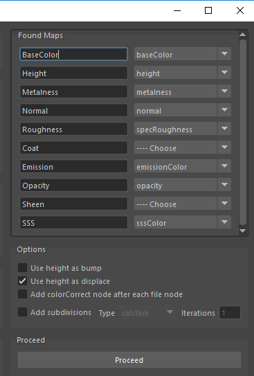

# Substance to Maya
## version 0.1

This tool is used to automatically connect Substance Painter textures to Arnold, VRay and Renderman for Maya.

## Installation

* Put the SubstancePainterToMaya folder in a maya script directory (I.e: C:\Users\user\Documents\maya\scripts on Windows)    
  

* The content of the folder need to be this one  
  
 
* Create a shelf button in Maya with the following Python command  
  

## How to use
1. Open a scene
  
2. Click on the shelf button to launch the tool  
  
3. Define the texture folder
4. Define the Naming Convention
5. Choose the renderer
6. Choose a materials option
7. Click on Launch  
  
8. Specify where to plug each found maps
9. Choose some options  
  
10. Click on Proceed  
  
11. Enjoy !  
  

## Features details

* #### Texture folder
Choose the folder that contains your Substance Painter textures  
Click **Get** to open a dialog to choose the folder or type the folder's path in the textfield  
By default, the tool uses the sourceImages folder of your project

* #### Naming convention
Use the same naming convention as your Painter map export.   
Use $map where you put your map's name (ex: diffuse)   
Tthe script needs $textureSet and $map to work.  
(I.e for a texture named rollingTeapot_aiStandardSurface1_BaseColor, the naming convention is $mesh_$textureSet_$map)  

Click the **Set button** and check the example bellow to see if it corresponds.  
Use whatever word you want for the other parts of your naming convention  
(I.e: 'mesh' is used by default to indicates that the textures files begin with a word)

* #### Renderer
Choose the renderer you want to use

* #### Materials
**Create new ones if they doesn't exist, instead use existing ones**  
If the tool find shaders named like your Naming Convention's $textureSet, and if the shaders are the ones used by your renderer, the textures will be plugged in those shaders, instead, the tool will create new shaders with the name and '_shd' as suffix. 
**Create new ones**  
The tool will create new shaders and plug the textures in them and add '_shd' suffix to the found name.  
**Use existing ones**  
If the tool find shaders named like your Naming Convention's $textureSet, and if the shaders are the ones used by your renderer, the textures will be plugged in those shaders, instead, nothing will append.

* #### Launch and Re-launch
Click this button to launch the search of the textures and the creation of the second part of the interface.  
Click the Re-launch button if you've changed the texture folder, the naming convention, the renderer, or after you've moved new textures in the Texture Folder and want to use that changes.

* #### Found Maps
Based on your Naming Convention, the tool will create lines  
On the left are the found names, and for each name, a dropdown menu is created on it's right to let you specify in which parameter you want to plug that map.   
The script automatically purpose parameters for usual maps (I.e: baseColor, BaseColor, albedo... are related to the baseColor parameter, but you can choose another one in the dropdown menu)   

* #### Options
**Use height as bump**  
If enabled, the height maps will be used as bump maps (if there's also a normalMap, both will be used in the bump parameter of the material)  
**Use height as displace**  
If enabled, the height maps will be used as displacement maps  
**Force texture replacement**  
If enabled, if the tool find a texture already connected to the needed parameter, it will break the connection and add the new texture instead   
**Add colorCorrect node after each file node**  
If enabled, the tool will add a colorCorrect node after each file node, before the connection to a utility or the material  
**Add subdivisions**  
If enabled, you can choose the type and the number of iterations you want  
For each model connected to an already existing shader used by the tool, render subdivisions will be added.

* #### Proceed
Click this button to import the textures, create the nodes and connect everything

## Step by step guides
[Arnold - Step by step](Arnold.md)

## Limitations

1. This version 0.1 only works with Arnold and Vray

## Features to come

1. Usable with Renderman
2. Choose the shader to use (I.e: aiStandardHair, aiStandardVolume...)
3. Add UDIMs option
4. Don't create nodes if they're not needed

## Credits

Created by Tristan Le Granche  
Licence CC-BY-NC  

Bugs report and ask for commercial use to tristan.legranche@gmail.com