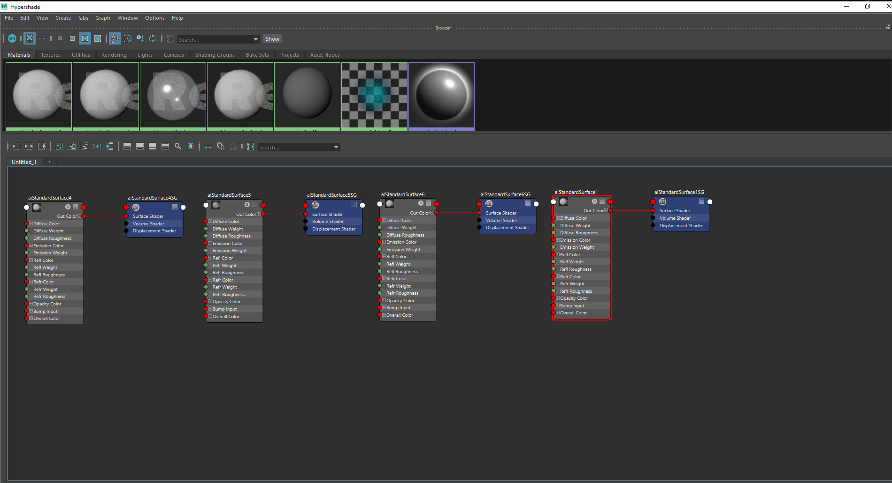
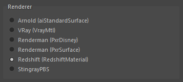
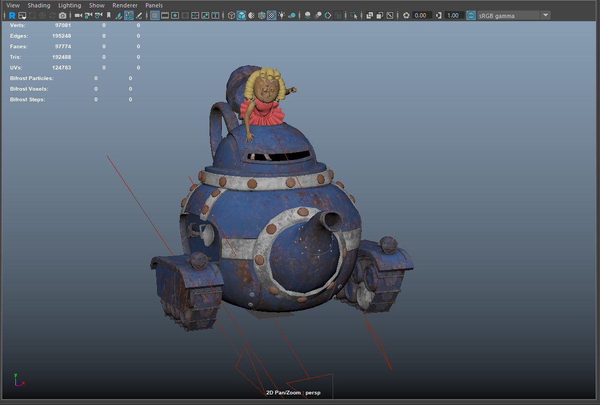
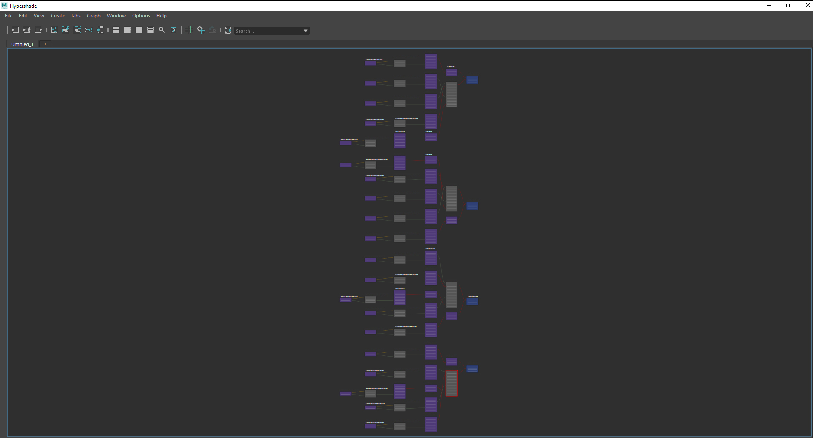
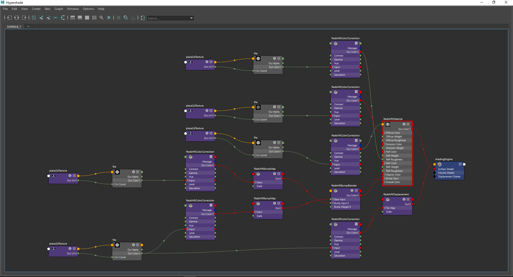

# Substance to Maya
## version 0.1
## Redshift PxrSurface example

[Go back to documentation](README.md)

1 - A scene is opened

2 - With existing materials

3 - I launch the tool

4 - I use the predefined texture folder (project/sourceImages) in my case, use **Get** to use another one

Here's the content of my folder

5 - I enter the textureSet and the map of one of my textures in the Naming Convention part

6 - I choose my render engine

7 - I choose to create new materials if there's no existing one

8 - I click on launch to search for the textures.

You can now see the list of the found maps, for each map you can specify in which PxrSurface parameter you want to plug it.
See that a Sheen, Coat and Emission have been found, let ---- Choose so they will not be used, or choose another parameter.
For more usual maps, the parameters are already set (but you can change them if you want)    

9 - I set the options (all in this case, so I will use height in bump and displace, add a colorCorrect after each file node and add subdivisions to the models)

10 - I click on proceed to launch the procedure

11 - Here is the result, textures are applied

12 - In the Hypershade I can see all the new nodes

13 - A material in details, with the colorCorrects, the connection for bump and normalMap, the displacement

14 - A created material, Lambert1 was defined as a name in my textureSets (see the texture folder content), because Lambert1 doesn't exist a new material Lambert1_shd has been created

15 - The models with already existing materials now have the subdivisions specified in the options

[Go back to documentation](README.md)
