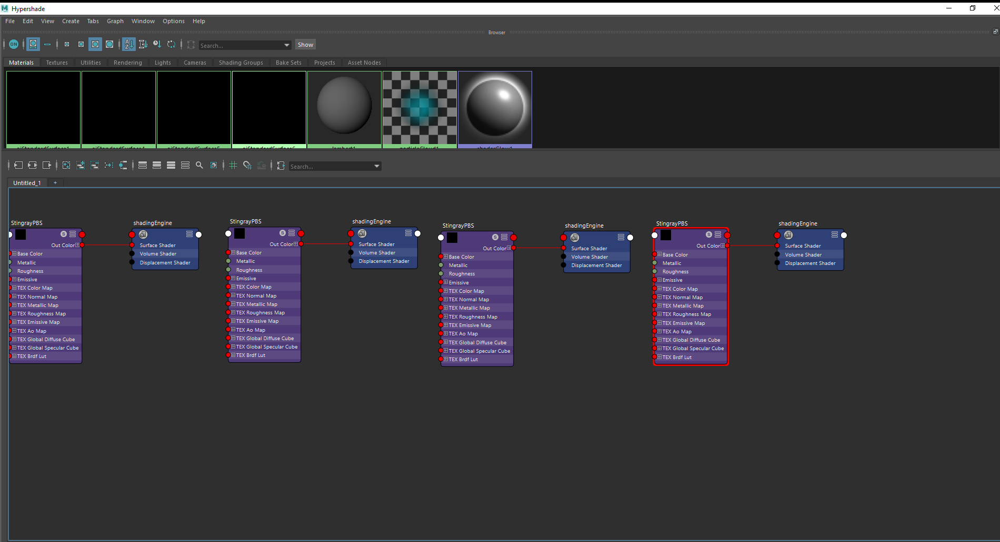
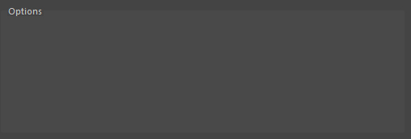
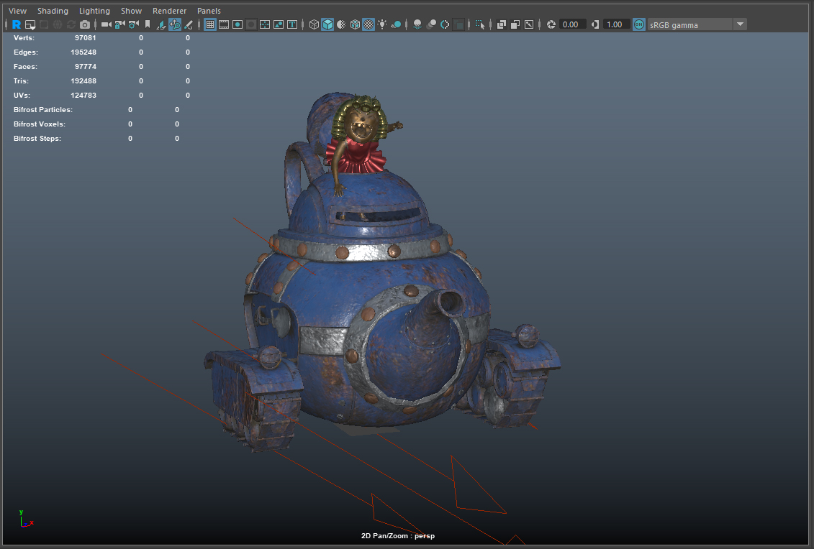
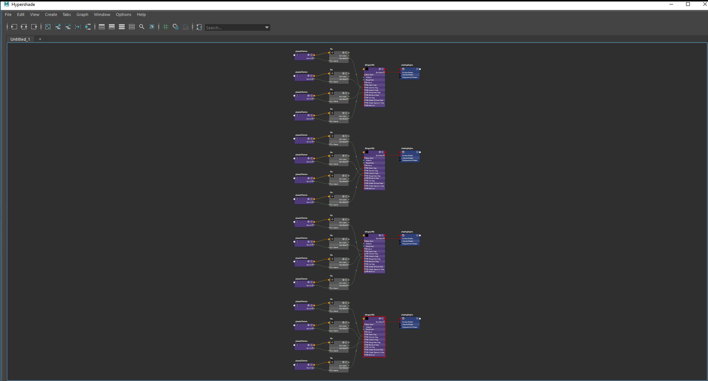
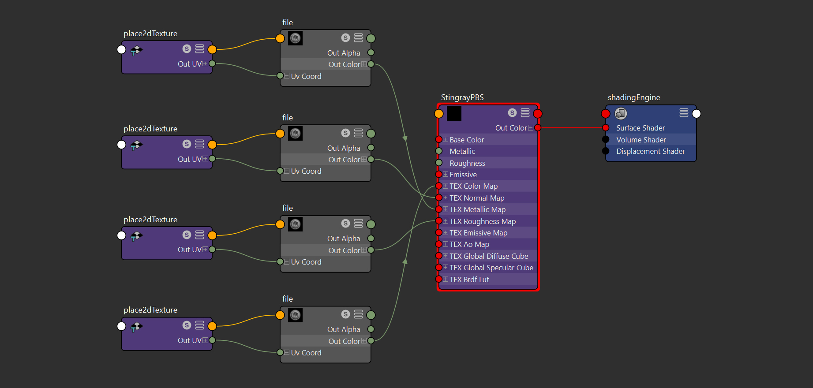

# Substance to Maya
## version 0.1
## Stingray  example

[Go back to documentation](README.md)

NOTES : You need existing StingrayPBS materials in your scene

1 - A scene is opened

2 - With existing materials

3 - I launch the tool

4 - I use the predefined texture folder (project/sourceImages) in my case, use **Get** to use another one

Here's the content of my folder

5 - I enter the textureSet and the map of one of my textures in the Naming Convention part

6 - I choose my render engine

7 - The stingray option only allow to use existing materials

8 - I click on launch to search for the textures.

You can now see the list of the found maps, for each map you can specify in which StingrayPBS parameter you want to plug it.
See that a Sheen, Coat, Height and SSS have been found, let ---- Choose so they will not be used, or choose another parameter.
For more usual maps, the parameters are already set (but you can change them if you want)

9 - There's no options for Stingray

10 - I click on proceed to launch the procedure

11 - Here is the result, textures are applied

12 - In the Hypershade I can see all the new nodes

13 - A material in details

14 - Enjoy !

[Go back to documentation](README.md)
